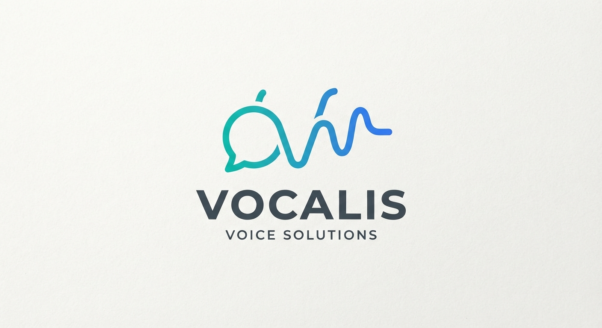

# Dysbuntu

  

> Logo Dysbuntu © 2026 Mathis Wensing. Tous droits réservés.  
> Le code source et les contenus du dépôt sont distribués sous licence GPL-3.0, sauf indication contraire.

Projet open source d'accessibilité informatique basé sur Ubuntu pour faciliter l'utilisation de Linux par les personnes dyslexiques, dysgraphiques ou dysorthographiques.

## Droits d'auteur et licence

Copyright © 2026 Mathis Wensing.

Sauf indication contraire, le code source et les contenus originaux de Dysbuntu sont distribués selon les conditions de la **GNU General Public License v3.0 (GPL-3.0)**. Consultez [LICENSE](LICENSE).

Les composants et ressources provenant de tiers restent soumis à leurs propres licences et droits d'auteur.

## Objectif

Dysbuntu a pour objectif de proposer un système Linux simple, accessible et personnalisable, avec des outils adaptés aux difficultés de lecture et d'écriture.

Le projet est basé sur Ubuntu et cherche également à favoriser la souveraineté numérique, la confidentialité et l'utilisation de logiciels libres.

## Police d'écriture

Dysbuntu utilise la police **OpenDyslexic** pour l'interface et les textes.

Cette police a été choisie pour rendre la lecture plus confortable pour certaines personnes dyslexiques, notamment grâce à la forme particulière de ses lettres.

## Logiciels et outils inclus

### Vocalis

  

Application de lecture de texte créée pour Dysbuntu.

* Synthèse vocale avec Piper
* eSpeak NG comme solution de secours
* Fonctionnement local
* Lecture de textes à voix haute

Code source : dossier `Vocalis/` dans ce dépôt.

### Dysbuntu Correcteur

  

Extension **LibreOffice Writer** (`.oxt`) qui corrige l'orthographe, la grammaire, les accords et la ponctuation du français.

* **Soulignement en direct** dans Writer selon le type d'erreur
* **Menu Dysbuntu** intégré : vérification de la sélection ou du document complet
* Revue guidée interactive : corriger en un clic, ignorer ou désactiver une règle
* Explications en phrases simples
* Personnalisation des types d'erreurs et taille du texte réglable
* Serveur **LanguageTool** local : tout fonctionne sans internet
* Rien n'est modifié sans votre clic

Code source : dossier `Dysbuntu-Correcteur/` dans ce dépôt.

### NumDys

  <em>Calculatrice scientifique et graphique pour Linux</em>

Calculatrice scientifique et graphique native pour Linux (testée sur Debian), inspirée par la NumWorks avec la police **OpenDyslexic**.

**Applications incluses :**
| Application  | Description |
|--------------|--------------|
| **Calculs**    | Calculatrice scientifique (sin, cos, tan, ln, log, √, puissance, π, e, Ans) avec historique |
| **Graphiques** | Traceur de courbes `y = f(x)`, avec zoom et déplacement |
| **Équations**  | Résolution du 1ᵉʳ et 2nd degré avec discriminant et racines complexes |
| **Suites**     | Suites définies par récurrence `u(n+1) = f(u, n)` |
| **Réglages**   | Bascule Degrés / Radians pour l'application |

Interface intuitive avec grille d'icônes et navigation fluide.

Code source : dossier `NumDys/` dans ce dépôt.

### LibreOffice

Suite bureautique libre.

Projet : https://github.com/LibreOffice/core

### ONLYOFFICE

Suite bureautique utilisée pour les documents.

Projet : https://github.com/ONLYOFFICE

### Mullvad Browser

Navigateur basé sur Firefox, conçu pour protéger la vie privée et limiter le pistage en ligne.

GitHub : [https://github.com/mullvad/mullvad-browser](https://github.com/mullvad/mullvad-browser)

### Stirling PDF

Outil libre permettant de manipuler et modifier des fichiers PDF.

Projet : https://github.com/Stirling-Tools/Stirling-PDF

### Piper

Moteur de synthèse vocale utilisé par Vocalis.

Projet : https://github.com/rhasspy/piper

### eSpeak NG

Moteur de synthèse vocale utilisé comme solution de secours dans Vocalis.

Projet : https://github.com/espeak-ng/espeak-ng

### LanguageTool

Moteur de correction orthographique et grammaticale utilisé par Dysbuntu Correcteur.

Projet : https://github.com/languagetoolorg/languagetool

## Technologies

* Ubuntu
* Linux
* Python
* Tkinter
* GTK3
* Piper
* eSpeak NG
* LanguageTool
* OpenDyslexic

## Accessibilité

Dysbuntu est pensé pour faciliter l'utilisation d'un ordinateur par les personnes ayant des difficultés de lecture ou d'écriture.

Le projet reste ouvert à tous et peut être utilisé comme une distribution Linux classique.

## Philosophie du projet

Dysbuntu est un projet personnel et open source qui cherche à créer un environnement Linux :

* simple
* accessible
* libre
* respectueux de la vie privée
* personnalisable
* basé sur la souveraineté numérique

Le but est de créer un système adapté aux besoins des utilisateurs sans dépendre uniquement de solutions propriétaires.
